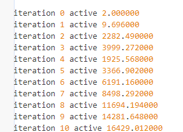

# 操作手册
## 注意事项
SGraph虽然采用了基于上界和下界的剪枝思想，但是实际实现中下界也是通过三角不等式影响到了上界。
## 环境配置
1，mpi用于程序间通信
2，libnuma for NUMA-aware memory allocation
3，编译需要支持openmp和c++11特性
## 编译
直接在根目录make
## 运行
./toolkits/pagerank [path] [vertices] [iterations]
./toolkits/cc [path] [vertices]
./toolkits/sssp [path] [vertices] [root]
./toolkits/bfs [path] [vertices] [root]
./toolkits/bc [path] [vertices] [root]
顶点的个数在下载图数据集时就确定了，cnr-2000顶点数应该是325557
# 代码说明
## 源码说明
这两个函数（`process_edges_sparse` 和 `process_edges_dense`）都似乎是用于处理图中的边的多线程算法，但具体方式不同。以下是这两个函数之间的主要差异：

1. **函数签名**:
    - `process_edges_sparse` 接受两个函数对象参数：一个名为 `sparse_signal` 的无返回值函数，另一个名为 `sparse_slot` 的返回类型为 `R` 的函数。
    - `process_edges_dense` 接受两个函数对象参数：一个名为 `dense_signal` 的无返回值函数，另一个名为 `dense_slot` 的返回类型为 `R` 的函数。
    - `process_edges_dense` 还接受额外的两个 `Bitmap` 指针参数 `dense_selective` 和 `dense_selective_hubs`，而 `process_edges_sparse` 不接受。

2. **数据同步**:
    - 在 `process_edges_dense` 中，有一个部分专门用于同步 `dense_selective` 和 `dense_selective_hubs` 位图数据，而 `process_edges_sparse` 中没有这部分代码。

3. **边的处理方式**:
    - `process_edges_sparse` 在处理边时似乎专注于“稀疏”数据或活动的顶点，因为它使用 `active` 位图来筛选顶点。
    - `process_edges_dense` 似乎处理所有的边，而不仅仅是那些与活动顶点相关的边。

4. **消息处理**:
    - 在两个函数中，消息的发送和接收都是使用 MPI 进行的。但是，具体的消息发送和接收的逻辑和次序在两个函数中有所不同。
    
5. **处理线程的逻辑**:
    - 两个函数都使用 OpenMP 进行多线程处理。但是，每个函数在多线程处理边时的具体逻辑略有不同。
    - 在 `process_edges_sparse` 中，处理主要集中在顶点上，而在 `process_edges_dense` 中，处理主要集中在边上。

6. **结果计算**:
    - 两者都使用了线程之间的 `reduction` 来计算累积结果，但它们处理的函数对象和数据不同。

7. **输出信息**:
    - 函数中的调试信息略有不同，例如 `process_edges_sparse` 输出 "sparse mode"，而 `process_edges_dense` 输出 "dense mode"。

总的来说，`process_edges_sparse` 和 `process_edges_dense` 是两种不同的方法来处理图中的边。前者似乎专注于处理与活动顶点相关的边，而后者处理所有的边。具体选择哪种方法可能取决于图的特性和预期的计算需求。
## 输出日志说明
日志文件位置：`result/log/dataset1.log`
日志输出：
分块读入文件，每次读入2^26条边，如果数据集很大不能一次读完，这段统计会出现很多次。

构建中心节点，每个顶点会记录到达所有中心顶点的最短路径的距离，以及这条路径上它的父节点。
对于有向图来说，它还会记录逆向的从中心顶点到所有顶点的最短路径的距离，以及这条路径上它的父节点。
代码中设置了16个中心节点，因为是有向的（正反方向都要记录），所以做了32次单源最短路径。

代码有静态和动态两种工作模式
对于静态模式
连续进行500次点对点查询

打印一些统计结果

打印每轮迭代活跃顶点数随轮次的变化，可以很明显看到，活跃顶点数（与计算量成正比）先增大后减少。

